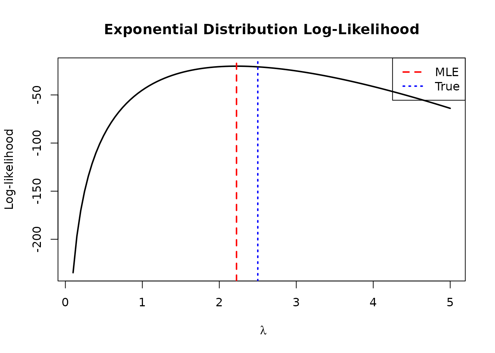
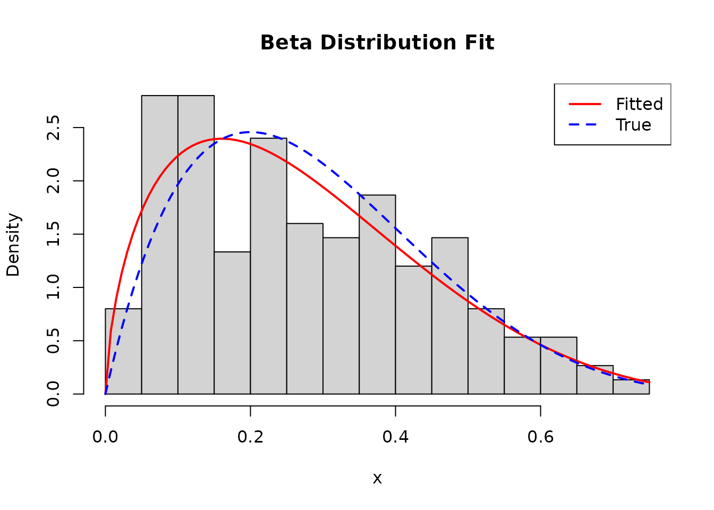
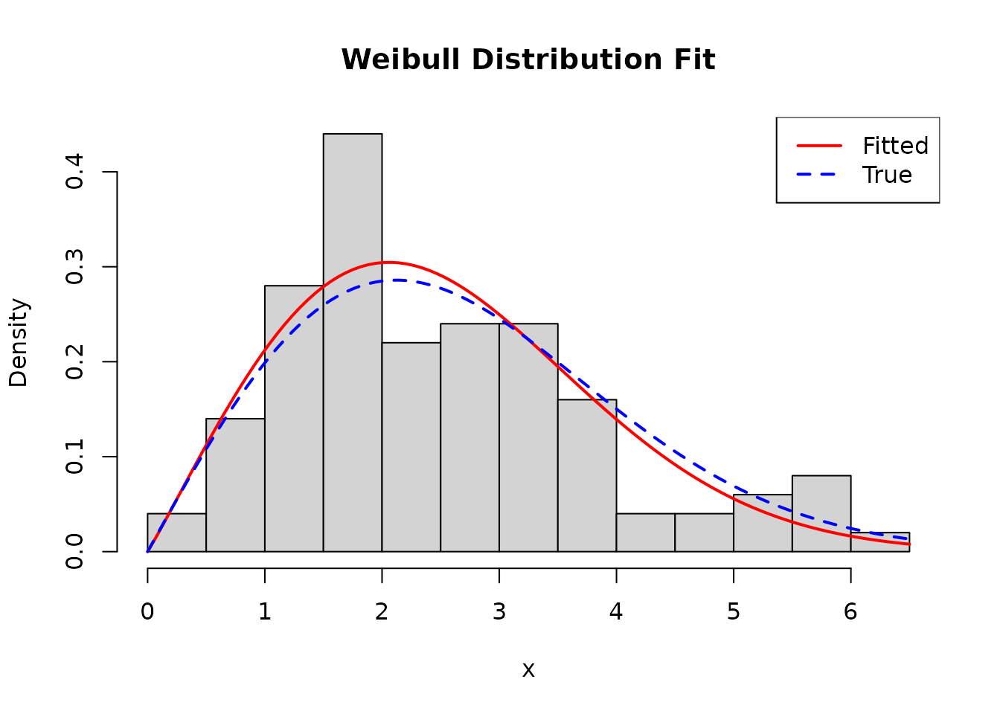
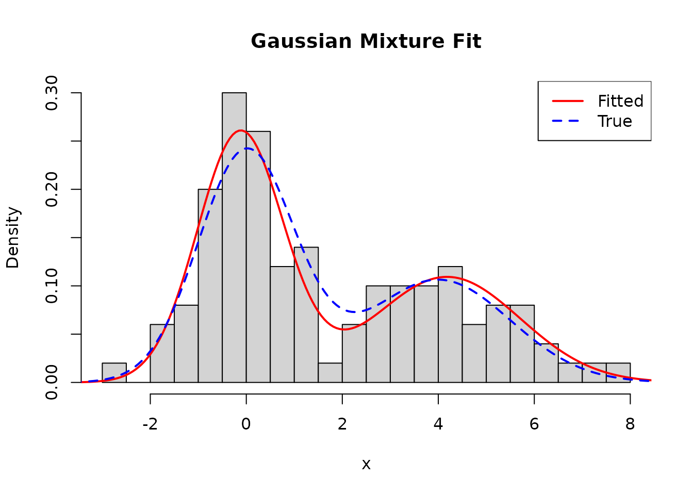

# Case Studies: MLE for Common Distributions

## Introduction

This vignette demonstrates using `compositional.mle` to fit various
probability distributions to data. Each case study shows:

- Problem definition with
  [`mle_problem()`](https://queelius.github.io/compositional.mle/reference/mle_problem.md)
- Composable solver strategies
- Comparison with analytical solutions

## Case Study 1: Exponential Distribution

The exponential distribution has one parameter: rate $\lambda > 0$.

``` r
# Generate data
n <- 100
true_rate <- 2.5
x_exp <- rexp(n, rate = true_rate)

# Define the problem
problem_exp <- mle_problem(
  loglike = function(lambda) {
    if (lambda <= 0) return(-Inf)
    n * log(lambda) - lambda * sum(x_exp)
  },
  score = function(lambda) n / lambda - sum(x_exp),
  constraint = mle_constraint(
    support = function(lambda) lambda > 0,
    project = function(lambda) max(lambda, 1e-8)
  )
)

# Solve
result_exp <- gradient_ascent(max_iter = 50)(problem_exp, theta0 = 1)

# Compare with analytical MLE: 1/mean(x)
mle_analytical <- 1 / mean(x_exp)

cat("Numerical MLE:  ", round(result_exp$theta.hat, 4), "\n")
#> Numerical MLE:   2.2236
cat("Analytical MLE: ", round(mle_analytical, 4), "\n")
#> Analytical MLE:  2.2236
cat("True rate:      ", true_rate, "\n")
#> True rate:       2.5
```

``` r
lambda_grid <- seq(0.1, 5, length.out = 100)
ll_values <- sapply(lambda_grid, problem_exp$loglike)

plot(lambda_grid, ll_values, type = "l", lwd = 2,
     xlab = expression(lambda), ylab = "Log-likelihood",
     main = "Exponential Distribution Log-Likelihood")
abline(v = result_exp$theta.hat, col = "red", lwd = 2, lty = 2)
abline(v = true_rate, col = "blue", lwd = 2, lty = 3)
legend("topright", c("MLE", "True"), col = c("red", "blue"), lty = c(2, 3), lwd = 2)
```



## Case Study 2: Gamma Distribution

Two parameters: shape $\alpha > 0$ and rate $\beta > 0$.

``` r
# Generate data
true_shape <- 3
true_rate <- 2
x_gamma <- rgamma(200, shape = true_shape, rate = true_rate)

# Define the problem
problem_gamma <- mle_problem(
  loglike = function(theta) {
    alpha <- theta[1]; beta <- theta[2]
    if (alpha <= 0 || beta <= 0) return(-Inf)
    n <- length(x_gamma)
    n * (alpha * log(beta) - lgamma(alpha)) +
      (alpha - 1) * sum(log(x_gamma)) - beta * sum(x_gamma)
  },
  score = function(theta) {
    alpha <- theta[1]; beta <- theta[2]
    n <- length(x_gamma)
    c(n * (log(beta) - digamma(alpha)) + sum(log(x_gamma)),
      n * alpha / beta - sum(x_gamma))
  },
  constraint = mle_constraint(
    support = function(theta) all(theta > 0),
    project = function(theta) pmax(theta, 1e-6)
  ),
  theta_names = c("alpha", "beta")
)
```

### Composing Solvers: Grid Search + Gradient Ascent

``` r
# Coarse-to-fine strategy
strategy <- grid_search(lower = c(0.5, 0.5), upper = c(10, 10), n = 10) %>>%
  gradient_ascent(max_iter = 100)

result_gamma <- strategy(problem_gamma, theta0 = c(1, 1))

cat("MLE:  shape =", round(result_gamma$theta.hat[1], 4),
    " rate =", round(result_gamma$theta.hat[2], 4), "\n")
#> MLE:  shape = 2.6662  rate = 1.852
cat("True: shape =", true_shape, " rate =", true_rate, "\n")
#> True: shape = 3  rate = 2
```

``` r
alpha_grid <- seq(1, 6, length.out = 50)
beta_grid <- seq(0.5, 4, length.out = 50)
ll_gamma <- outer(alpha_grid, beta_grid, function(a, b) {
  mapply(function(ai, bi) problem_gamma$loglike(c(ai, bi)), a, b)
})

contour(alpha_grid, beta_grid, ll_gamma, nlevels = 20,
        xlab = expression(alpha ~ "(shape)"),
        ylab = expression(beta ~ "(rate)"),
        main = "Gamma Distribution Log-Likelihood")
points(result_gamma$theta.hat[1], result_gamma$theta.hat[2],
       pch = 19, col = "red", cex = 1.5)
points(true_shape, true_rate, pch = 4, col = "blue", cex = 1.5, lwd = 2)
legend("topright", c("MLE", "True"), pch = c(19, 4), col = c("red", "blue"))
```


## Case Study 3: Beta Distribution

Shape parameters $\alpha > 0$ and $\beta > 0$ for data on
$\lbrack 0,1\rbrack$.

``` r
# Generate data
true_alpha <- 2
true_beta <- 5
x_beta <- rbeta(150, shape1 = true_alpha, shape2 = true_beta)

# Define the problem
problem_beta <- mle_problem(
  loglike = function(theta) {
    a <- theta[1]; b <- theta[2]
    if (a <= 0 || b <= 0) return(-Inf)
    n <- length(x_beta)
    n * (lgamma(a + b) - lgamma(a) - lgamma(b)) +
      (a - 1) * sum(log(x_beta)) + (b - 1) * sum(log(1 - x_beta))
  },
  score = function(theta) {
    a <- theta[1]; b <- theta[2]
    n <- length(x_beta)
    psi_ab <- digamma(a + b)
    c(n * (psi_ab - digamma(a)) + sum(log(x_beta)),
      n * (psi_ab - digamma(b)) + sum(log(1 - x_beta)))
  },
  constraint = mle_constraint(
    support = function(theta) all(theta > 0),
    project = function(theta) pmax(theta, 1e-6)
  )
)

# Method of moments for starting values
m <- mean(x_beta); v <- var(x_beta)
alpha_start <- m * (m * (1 - m) / v - 1)
beta_start <- (1 - m) * (m * (1 - m) / v - 1)

result_beta <- gradient_ascent(max_iter = 200)(
  problem_beta,
  theta0 = c(max(alpha_start, 0.5), max(beta_start, 0.5))
)

cat("MLE:  alpha =", round(result_beta$theta.hat[1], 4),
    " beta =", round(result_beta$theta.hat[2], 4), "\n")
#> MLE:  alpha = 1.6398  beta = 4.3577
cat("True: alpha =", true_alpha, " beta =", true_beta, "\n")
#> True: alpha = 2  beta = 5
```

``` r
hist(x_beta, breaks = 20, freq = FALSE, col = "lightgray",
     main = "Beta Distribution Fit", xlab = "x")
curve(dbeta(x, result_beta$theta.hat[1], result_beta$theta.hat[2]),
      add = TRUE, col = "red", lwd = 2)
curve(dbeta(x, true_alpha, true_beta), add = TRUE, col = "blue", lwd = 2, lty = 2)
legend("topright", c("Fitted", "True"), col = c("red", "blue"), lwd = 2, lty = c(1, 2))
```



## Case Study 4: Weibull Distribution

Shape $k > 0$ and scale $\lambda > 0$, using Newton-Raphson.

``` r
# Generate data
true_k <- 2; true_lambda <- 3
x_weibull <- rweibull(100, shape = true_k, scale = true_lambda)

# Define the problem (score only, Fisher computed numerically)
problem_weibull <- mle_problem(
  loglike = function(theta) {
    k <- theta[1]; lambda <- theta[2]
    if (k <= 0 || lambda <= 0) return(-Inf)
    n <- length(x_weibull)
    n * log(k) - n * k * log(lambda) +
      (k - 1) * sum(log(x_weibull)) - sum((x_weibull / lambda)^k)
  },
  score = function(theta) {
    k <- theta[1]; lambda <- theta[2]
    n <- length(x_weibull)
    x_scaled <- x_weibull / lambda
    x_scaled_k <- x_scaled^k
    c(n / k - n * log(lambda) + sum(log(x_weibull)) - sum(x_scaled_k * log(x_scaled)),
      -n * k / lambda + k * sum(x_scaled_k) / lambda)
  },
  constraint = mle_constraint(
    support = function(theta) all(theta > 0),
    project = function(theta) pmax(theta, 1e-6)
  )
)

# Newton-Raphson with numerical Fisher
result_weibull <- newton_raphson(max_iter = 50)(problem_weibull, theta0 = c(1, 1))

cat("MLE:  shape =", round(result_weibull$theta.hat[1], 4),
    " scale =", round(result_weibull$theta.hat[2], 4), "\n")
#> MLE:  shape = 2.0466  scale = 2.8588
cat("True: shape =", true_k, " scale =", true_lambda, "\n")
#> True: shape = 2  scale = 3
```

``` r
hist(x_weibull, breaks = 15, freq = FALSE, col = "lightgray",
     main = "Weibull Distribution Fit", xlab = "x")
curve(dweibull(x, shape = result_weibull$theta.hat[1],
               scale = result_weibull$theta.hat[2]),
      add = TRUE, col = "red", lwd = 2)
curve(dweibull(x, shape = true_k, scale = true_lambda),
      add = TRUE, col = "blue", lwd = 2, lty = 2)
legend("topright", c("Fitted", "True"), col = c("red", "blue"), lwd = 2, lty = c(1, 2))
```



## Case Study 5: Mixture of Normals

Multimodal likelihood requires good initialization and restarts.

``` r
# Generate mixture data
n1 <- 60; n2 <- 40
x_mix <- c(rnorm(n1, mean = 0, sd = 1), rnorm(n2, mean = 4, sd = 1.5))

# Parameters: (mu1, sigma1, mu2, sigma2, pi)
problem_mix <- mle_problem(
  loglike = function(theta) {
    mu1 <- theta[1]; s1 <- theta[2]
    mu2 <- theta[3]; s2 <- theta[4]
    pi1 <- theta[5]
    if (s1 <= 0 || s2 <= 0 || pi1 <= 0 || pi1 >= 1) return(-Inf)
    # Log-sum-exp for numerical stability
    log_p1 <- log(pi1) + dnorm(x_mix, mu1, s1, log = TRUE)
    log_p2 <- log(1 - pi1) + dnorm(x_mix, mu2, s2, log = TRUE)
    log_max <- pmax(log_p1, log_p2)
    sum(log_max + log(exp(log_p1 - log_max) + exp(log_p2 - log_max)))
  },
  constraint = mle_constraint(
    support = function(theta) theta[2] > 0 && theta[4] > 0 && theta[5] > 0 && theta[5] < 1,
    project = function(theta) c(theta[1], max(theta[2], 0.1), theta[3],
                                 max(theta[4], 0.1), min(max(theta[5], 0.01), 0.99))
  )
)

# Use k-means for initialization
km <- kmeans(x_mix, centers = 2)
mu1_init <- min(km$centers); mu2_init <- max(km$centers)
s1_init <- sd(x_mix[km$cluster == which.min(km$centers)])
s2_init <- sd(x_mix[km$cluster == which.max(km$centers)])
pi_init <- mean(km$cluster == which.min(km$centers))

result_mix <- gradient_ascent(learning_rate = 0.5, max_iter = 300)(
  problem_mix,
  theta0 = c(mu1_init, s1_init, mu2_init, s2_init, pi_init)
)

cat("Fitted:\n")
#> Fitted:
cat("  Component 1: mu =", round(result_mix$theta.hat[1], 2),
    " sigma =", round(result_mix$theta.hat[2], 2), "\n")
#>   Component 1: mu = -0.13  sigma = 0.9
cat("  Component 2: mu =", round(result_mix$theta.hat[3], 2),
    " sigma =", round(result_mix$theta.hat[4], 2), "\n")
#>   Component 2: mu = 4.18  sigma = 1.53
cat("  Mixing proportion:", round(result_mix$theta.hat[5], 2), "\n")
#>   Mixing proportion: 0.58
```

``` r
hist(x_mix, breaks = 25, freq = FALSE, col = "lightgray",
     main = "Gaussian Mixture Fit", xlab = "x")

x_seq <- seq(min(x_mix) - 1, max(x_mix) + 1, length.out = 200)
fitted_density <- result_mix$theta.hat[5] *
  dnorm(x_seq, result_mix$theta.hat[1], result_mix$theta.hat[2]) +
  (1 - result_mix$theta.hat[5]) *
  dnorm(x_seq, result_mix$theta.hat[3], result_mix$theta.hat[4])
lines(x_seq, fitted_density, col = "red", lwd = 2)

true_density <- (n1/(n1+n2)) * dnorm(x_seq, 0, 1) + (n2/(n1+n2)) * dnorm(x_seq, 4, 1.5)
lines(x_seq, true_density, col = "blue", lwd = 2, lty = 2)
legend("topright", c("Fitted", "True"), col = c("red", "blue"), lwd = 2, lty = c(1, 2))
```



## Summary

| Distribution | Strategy                                                                                                                     | Key Considerations       |
|--------------|------------------------------------------------------------------------------------------------------------------------------|--------------------------|
| Exponential  | [`gradient_ascent()`](https://queelius.github.io/compositional.mle/reference/gradient_ascent.md)                             | Simple, single parameter |
| Gamma        | `grid_search() %>>% gradient_ascent()`                                                                                       | Coarse-to-fine for 2D    |
| Beta         | [`gradient_ascent()`](https://queelius.github.io/compositional.mle/reference/gradient_ascent.md) with method of moments init | Good starting values     |
| Weibull      | [`newton_raphson()`](https://queelius.github.io/compositional.mle/reference/newton_raphson.md)                               | Second-order convergence |
| Mixture      | [`gradient_ascent()`](https://queelius.github.io/compositional.mle/reference/gradient_ascent.md) with k-means init           | Multimodal likelihood    |

Key takeaways:

1.  **Separate problem from solver** -
    [`mle_problem()`](https://queelius.github.io/compositional.mle/reference/mle_problem.md)
    encapsulates the model
2.  **Compose strategies** - Use `%>>%` for coarse-to-fine optimization
3.  **Use constraints** - Keep parameters in valid ranges
4.  **Good initialization** - Critical for multimodal problems
