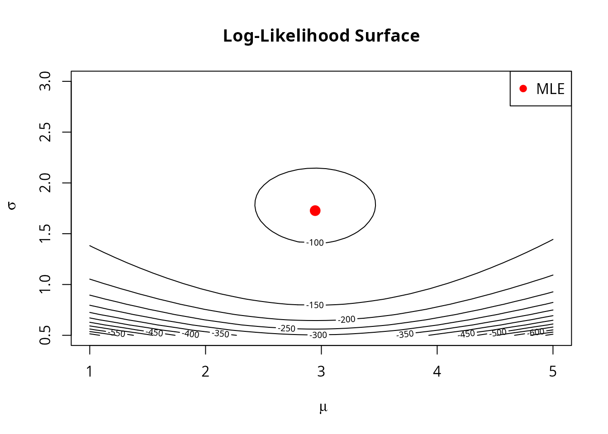

# Theory and Intuition Behind Numerical MLE

## What is Maximum Likelihood Estimation?

Maximum Likelihood Estimation (MLE) is a fundamental method for
estimating the parameters of a statistical model. The idea is simple yet
powerful: **find the parameter values that make the observed data most
probable**.

### The Likelihood Function

Suppose we observe data $x_{1},x_{2},\ldots,x_{n}$ and we believe it
comes from a probability distribution with parameter(s) $\theta$. The
**likelihood function** $L(\theta)$ measures how probable the observed
data is, given parameter $\theta$:

$$L(\theta) = P\left( X_{1} = x_{1},X_{2} = x_{2},\ldots,X_{n} = x_{n} \mid \theta \right)$$

For independent observations:

$$L(\theta) = \prod\limits_{i = 1}^{n}f\left( x_{i} \mid \theta \right)$$

where $f( \cdot \mid \theta)$ is the probability density (or mass)
function.

### Why Log-Likelihood?

Working with products is numerically unstable and mathematically
inconvenient. Taking the logarithm converts products to sums:

$$\ell(\theta) = \log L(\theta) = \sum\limits_{i = 1}^{n}\log f\left( x_{i} \mid \theta \right)$$

Since $\log$ is monotonic, maximizing $\ell(\theta)$ is equivalent to
maximizing $L(\theta)$. The log-likelihood has several advantages:

1.  **Numerical stability**: Products of small probabilities can
    underflow to zero
2.  **Computational efficiency**: Sums are faster than products
3.  **Mathematical convenience**: Derivatives of sums are easier than
    derivatives of products
4.  **Statistical properties**: The curvature of $\ell(\theta)$ relates
    to estimation uncertainty

### A Concrete Example

Let’s see this with normal data:

``` r
set.seed(42)
x <- rnorm(50, mean = 3, sd = 1.5)

# Log-likelihood function for normal distribution
loglike <- function(theta) {
  mu <- theta[1]
  sigma <- theta[2]
  if (sigma <= 0) return(-Inf)
  sum(dnorm(x, mean = mu, sd = sigma, log = TRUE))
}

# Visualize the log-likelihood surface
mu_grid <- seq(1, 5, length.out = 50)
sigma_grid <- seq(0.5, 3, length.out = 50)
ll_surface <- outer(mu_grid, sigma_grid, function(m, s) {
  mapply(function(mi, si) loglike(c(mi, si)), m, s)
})

# Contour plot
contour(mu_grid, sigma_grid, ll_surface, nlevels = 20,
        xlab = expression(mu), ylab = expression(sigma),
        main = "Log-Likelihood Surface")
points(mean(x), sd(x), pch = 19, col = "red", cex = 1.5)
legend("topright", "MLE", pch = 19, col = "red")
```



The MLE is the point on this surface with the highest value (deepest red
in the contour plot).

## The Score Function

The **score function** is the gradient (vector of partial derivatives)
of the log-likelihood:

$$s(\theta) = \nabla_{\theta}\ell(\theta) = \left( \frac{\partial\ell}{\partial\theta_{1}},\ldots,\frac{\partial\ell}{\partial\theta_{p}} \right)$$

At the MLE $\widehat{\theta}$, the score is zero:
$s\left( \widehat{\theta} \right) = 0$.

### Intuition

The score tells us the **direction of steepest ascent** on the
log-likelihood surface. If $s(\theta) \neq 0$, we can increase the
likelihood by moving in the direction of $s(\theta)$.

``` r
# Score function for normal distribution
score <- function(theta) {
  mu <- theta[1]
  sigma <- theta[2]
  n <- length(x)
  c(
    sum(x - mu) / sigma^2,                        # d/d_mu
    -n / sigma + sum((x - mu)^2) / sigma^3        # d/d_sigma
  )
}

# At a point away from the MLE, the score points toward the MLE
theta_start <- c(1, 0.8)
s <- score(theta_start)
cat("Score at (1, 0.8):", round(s, 2), "\n")
#> Score at (1, 0.8): 152.07 593.01
cat("Direction: move", ifelse(s[1] > 0, "right", "left"), "in mu,",
    ifelse(s[2] > 0, "up", "down"), "in sigma\n")
#> Direction: move right in mu, up in sigma
```

## Gradient Ascent

**Gradient ascent** is the simplest optimization algorithm. It
iteratively moves in the direction of the gradient:

$$\theta^{(t + 1)} = \theta^{(t)} + \eta \cdot s\left( \theta^{(t)} \right)$$

where $\eta > 0$ is the **learning rate** (step size).

### Why It Works

The score points in the direction of steepest increase. Taking small
steps in this direction guarantees improvement (for small enough
$\eta$).

### The Challenge: Choosing the Step Size

- **Too large**: We might overshoot and oscillate
- **Too small**: Convergence is painfully slow

``` r
# Demonstrate gradient ascent with different step sizes
run_gradient_ascent <- function(eta, max_iter = 50) {
  theta <- c(1, 0.8)
  path <- matrix(NA, max_iter + 1, 2)
  path[1, ] <- theta

  for (i in 1:max_iter) {
    theta <- theta + eta * score(theta)
    if (theta[2] <= 0) theta[2] <- 0.01  # Enforce constraint
    path[i + 1, ] <- theta
  }
  path
}

# Compare step sizes
path_small <- run_gradient_ascent(0.001)
path_good <- run_gradient_ascent(0.01)
path_large <- run_gradient_ascent(0.05)

# Plot paths
contour(mu_grid, sigma_grid, ll_surface, nlevels = 15,
        xlab = expression(mu), ylab = expression(sigma),
        main = "Gradient Ascent: Effect of Step Size")
lines(path_small[, 1], path_small[, 2], col = "blue", lwd = 2)
lines(path_good[, 1], path_good[, 2], col = "green", lwd = 2)
lines(path_large[1:20, 1], path_large[1:20, 2], col = "red", lwd = 2)
points(mean(x), sd(x), pch = 19, cex = 1.5)
legend("topright", c("Small (0.001)", "Good (0.01)", "Large (0.05)"),
       col = c("blue", "green", "red"), lwd = 2)
```


### Line Search: Automatic Step Size Selection

**Backtracking line search** adaptively finds a good step size:

1.  Start with a large step size
2.  If it doesn’t improve the objective enough, shrink it
3.  Repeat until we find an acceptable step

This is implemented in
[`mle_config_linesearch()`](https://queelius.github.io/numerical.mle/reference/mle_config_linesearch.md):

``` r
result <- mle_gradient_ascent(
  loglike = loglike,
  score = score,
  theta0 = c(1, 0.8),
  config = mle_config_linesearch(max_iter = 50, trace = TRUE),
  constraint = mle_constraint(
    support = function(theta) theta[2] > 0,
    project = function(theta) c(theta[1], max(theta[2], 1e-6))
  )
)

cat("Final estimate:", round(result$theta.hat, 4), "\n")
#> Final estimate: 2.9472 1.7103
cat("Iterations:", result$iter, "\n")
#> Iterations: 8
cat("Converged:", result$converged, "\n")
#> Converged: FALSE
```

## The Fisher Information Matrix

The **Fisher information matrix** $I(\theta)$ measures how much
information the data carries about $\theta$:

$$I(\theta) = - E\left\lbrack \frac{\partial^{2}\ell}{\partial\theta\partial\theta^{T}} \right\rbrack$$

It’s also related to the variance of the score:
$I(\theta) = \text{Var}\left( s(\theta) \right)$.

### Why It Matters

1.  **Curvature**: $I(\theta)$ describes the curvature of the
    log-likelihood surface
2.  **Uncertainty**: The inverse $I(\theta)^{- 1}$ approximates the
    covariance of $\widehat{\theta}$
3.  **Natural scaling**: Different parameters may have different scales;
    $I(\theta)$ accounts for this

### Observed vs Expected Fisher Information

- **Expected information**:
  $I(\theta) = - E\left\lbrack \nabla^{2}\ell(\theta) \right\rbrack$
- **Observed information**: $J(\theta) = - \nabla^{2}\ell(\theta)$
  (evaluated at the data)

In practice, we often use the observed information, which doesn’t
require computing expectations.

## Newton-Raphson

**Newton-Raphson** uses the Fisher information to take smarter steps:

$$\theta^{(t + 1)} = \theta^{(t)} + I\left( \theta^{(t)} \right)^{- 1}s\left( \theta^{(t)} \right)$$

### Intuition

Gradient ascent treats all directions equally, but some directions might
be “easier” to move in than others. Newton-Raphson pre-multiplies by
$I^{- 1}$, which:

- Takes larger steps in flat directions (low curvature)
- Takes smaller steps in curved directions (high curvature)
- Accounts for correlations between parameters

### Comparison

``` r
# Fisher information for normal distribution
fisher <- function(theta) {
  sigma <- theta[2]
  n <- length(x)
  matrix(c(
    n / sigma^2, 0,
    0, 2 * n / sigma^2
  ), nrow = 2)
}

# Run gradient ascent
result_ga <- mle_gradient_ascent(
  loglike = loglike,
  score = score,
  theta0 = c(1, 0.8),
  config = mle_config_linesearch(max_iter = 100, trace = TRUE),
  constraint = mle_constraint(
    support = function(theta) theta[2] > 0,
    project = function(theta) c(theta[1], max(theta[2], 1e-6))
  )
)

# Run Newton-Raphson
result_nr <- mle_newton_raphson(
  loglike = loglike,
  score = score,
  fisher = fisher,
  theta0 = c(1, 0.8),
  config = mle_config_linesearch(max_iter = 100, trace = TRUE),
  constraint = mle_constraint(
    support = function(theta) theta[2] > 0,
    project = function(theta) c(theta[1], max(theta[2], 1e-6))
  )
)

cat("Gradient Ascent: ", result_ga$iter, "iterations\n")
#> Gradient Ascent:  8 iterations
cat("Newton-Raphson:  ", result_nr$iter, "iterations\n")
#> Newton-Raphson:   11 iterations
```

Newton-Raphson typically converges much faster, especially near the
optimum where its quadratic convergence kicks in.

## When to Use Which Method

### Use Gradient Ascent When:

- You don’t have (or can’t easily compute) the Fisher information
- The problem is high-dimensional (computing $I^{- 1}$ is expensive)
- You’re using stochastic gradients (mini-batches)
- Getting a rough answer quickly is acceptable

### Use Newton-Raphson When:

- You need high precision
- The Fisher information is available and cheap to compute
- The problem is low-to-moderate dimensional
- Fast convergence is important

### Use Grid Search When:

- The parameter space is small (1-3 dimensions)
- You need a good starting point
- The likelihood surface might have multiple modes

### Use Random Restart When:

- The likelihood surface has multiple local maxima
- You’re uncertain about good starting values
- Robustness is more important than speed

## Constrained Optimization

Real problems often have **constraints** on parameters:

- Variance must be positive: $\sigma > 0$
- Probabilities must be in $\lbrack 0,1\rbrack$
- Correlation must satisfy $|\rho| < 1$

### Projection Method

The `numerical.mle` package uses **projection**: if a step takes us
outside the feasible region, we project back to the nearest feasible
point.

``` r
# Without constraint: optimization might fail
constraint <- mle_constraint(
  support = function(theta) theta[2] > 0,
  project = function(theta) c(theta[1], max(theta[2], 1e-6))
)

# The constraint keeps sigma positive throughout optimization
result <- mle_gradient_ascent(
  loglike = loglike,
  score = score,
  theta0 = c(0, 0.1),  # Start near the boundary
  config = mle_config_linesearch(max_iter = 100),
  constraint = constraint
)

cat("Final sigma:", result$theta.hat[2], "> 0 (constraint satisfied)\n")
#> Final sigma: 1.710644 > 0 (constraint satisfied)
```

## Regularization and Penalized Likelihood

Sometimes we want to **penalize** certain parameter values to:

- Prevent overfitting
- Encourage sparsity
- Incorporate prior beliefs

### Penalized Log-Likelihood

$$\ell_{\lambda}(\theta) = \ell(\theta) - \lambda \cdot P(\theta)$$

where $P(\theta)$ is a penalty function and $\lambda > 0$ controls
regularization strength.

### Common Penalties

**L1 (LASSO)**: $P(\theta) = \sum_{j}\left| \theta_{j} \right|$

- Encourages sparsity (some $\theta_{j} = 0$)
- Useful for variable selection

**L2 (Ridge)**: $P(\theta) = \sum_{j}\theta_{j}^{2}$

- Shrinks parameters toward zero
- Prevents extreme values
- Equivalent to Gaussian prior

**Elastic Net**:
$P(\theta) = \alpha\sum_{j}\left| \theta_{j} \right| + (1 - \alpha)\sum_{j}\theta_{j}^{2}$

- Combines L1 and L2 benefits
- $\alpha$ controls the mix

``` r
# Original log-likelihood (maximum at theta = 0)
loglike <- function(theta) -sum((theta - c(3, 2))^2)

# Add L2 penalty
loglike_l2 <- with_penalty(loglike, penalty_l2(), lambda = 1)

# Compare
theta <- c(3, 2)
cat("At theta = (3, 2):\n")
#> At theta = (3, 2):
cat("  Original:", loglike(theta), "\n")
#>   Original: 0
cat("  With L2 penalty:", loglike_l2(theta), "\n")
#>   With L2 penalty: -13
cat("  The penalty shrinks the solution toward zero\n")
#>   The penalty shrinks the solution toward zero
```

## Stochastic Gradient Methods

For large datasets, computing the full gradient is expensive.
**Stochastic gradient ascent** uses random subsamples:

$$\theta^{(t + 1)} = \theta^{(t)} + \eta \cdot \widehat{s}\left( \theta^{(t)} \right)$$

where $\widehat{s}$ is computed on a mini-batch of data.

### Properties

- **Noisy but unbiased**: On average, we move in the right direction
- **Faster iterations**: Each step is cheap
- **Implicit regularization**: Noise can help escape local optima
- **Requires care**: Learning rate schedules, momentum, etc.

``` r
# Concept demonstration (not run)
loglike_full <- function(theta, obs = large_data) {
  sum(dnorm(obs, theta[1], theta[2], log = TRUE))
}

# Use only 100 observations per iteration
loglike_mini <- with_subsampling(
  loglike_full,
  data = large_data,
  subsample_size = 100
)
```

## Convergence Criteria

The package checks for convergence using:

1.  **Absolute tolerance**:
    $\left| \ell\left( \theta^{(t + 1)} \right) - \ell\left( \theta^{(t)} \right) \right| < \epsilon_{abs}$
2.  **Relative tolerance**:
    $\frac{\left| \ell\left( \theta^{(t + 1)} \right) - \ell\left( \theta^{(t)} \right) \right|}{\left| \ell\left( \theta^{(t)} \right) \right|} < \epsilon_{rel}$
3.  **Parameter change**:
    $\parallel \theta^{(t + 1)} - \theta^{(t)} \parallel < \epsilon$
4.  **Maximum iterations**: Safety stop

``` r
config <- mle_config(
  max_iter = 500,     # Don't run forever
  abs_tol = 1e-8,     # Absolute change threshold
  rel_tol = 1e-6,     # Relative change threshold
  debug = FALSE       # Set TRUE to see iteration progress
)
```

## Summary

| Method          | Order | Information Needed | Best For                        |
|-----------------|-------|--------------------|---------------------------------|
| Gradient Ascent | 1st   | Score only         | Large problems, rough estimates |
| Newton-Raphson  | 2nd   | Score + Fisher     | High precision, small problems  |
| Grid Search     | 0th   | Likelihood only    | Finding starting points         |
| Random Restart  | \-    | Varies             | Multi-modal problems            |

The `numerical.mle` package provides a unified interface to all these
methods, with composable configuration objects and function transformers
to handle real-world complexities like constraints, regularization, and
large datasets.

## Further Reading

1.  Casella, G. and Berger, R.L. (2002). *Statistical Inference*.
    Duxbury.
2.  Nocedal, J. and Wright, S.J. (2006). *Numerical Optimization*.
    Springer.
3.  Murphy, K.P. (2012). *Machine Learning: A Probabilistic
    Perspective*. MIT Press.
