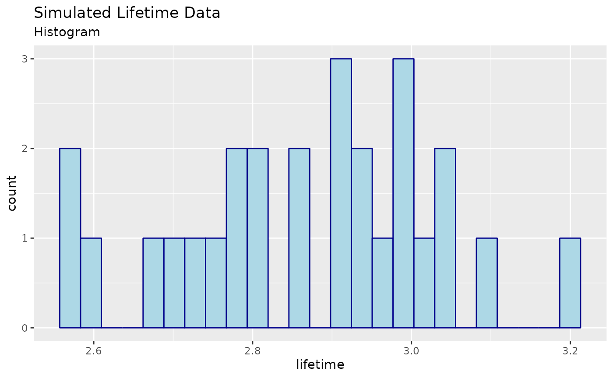

# Fitting models to unknown DGPs

## Introduction

We are interested in the generative process that gave rise to the data
we observed. In the real world, DGPs are quite complex, but we settle
for simpler models for analytical tractability. So, we usually assume:

1.  The sample is i.i.d.

2.  We have a way of evaluating the quality of the model.

3.  We have a way of choosing between models.

Since this is a simulation, we know the underlying DGP (data generating
process). It’s just \\ T_i = W_i + \epsilon_i \\ where \\ W_i \sim
\operatorname{weibull}(k,\lambda) \\ and \\ \epsilon_i \sim
\operatorname{normal}(0,\sigma). \\

In the real world, we do not know the DGP. In this study, we will assume
that either \\T_1,\ldots,T_n\\ comes from Weibull or Normal. Clearly,
the true DGF is a bit more complicated but still very simple compared to
a more realistic DGP.

Then, the process of parametrically modeling the observed data may take
the following steps:

1.  Visualize the data, e.g., plot a histogram of the data.

2.  Guess which parametric distribution (for the components) might fit
    the observed data for the system lifetime.

3.  Use a statistical test for goodness-of-fit.

4.  Repeat steps 2 and 3 if the measure of goodness of fit is not
    satisfactory.

## Simulation parameters and generation

The simulation parameters are given by:

``` r
library(tibble)
library(stats)

sim.n <- 27
sim.err.sd <- 0.05
sim.shape <- 20
sim.scale <- 3
sim.theta = c(sim.shape,sim.scale)
set.seed(142334)
```

We generate the data with the following R code:

``` r
sim.df <- tibble(lifetime=
  rweibull(n=sim.n, shape=sim.shape, scale=sim.scale) +
  rnorm(n=sim.n, mean=0, sd=sim.err.sd))
```

A few elements from the sample are given by:

    #> # A tibble: 6 × 1
    #>   lifetime
    #>      <dbl>
    #> 1     2.91
    #> 2     2.73
    #> 3     3.09
    #> 4     2.91
    #> 5     3.20
    #> 6     2.94

## Visualizing the data

Visualizing the data is a good first step in the analysis of the data.
If the data is univariate or bivariate, we can plot a histogram of the
data pretty easily (if it’s multivariate, we can plot the marginal
distributions of the data).

We show a histogram of the simulated data below:


## Parametrically modeling the data

If we only had this sample, what might we conclude? This can be a very
difficult problem. In our case, we know that the simulated data is drawn
from the distribution \\T_i = W_i + \epsilon_i\\ where \\ W_i \sim
\operatorname{weibull}(\lambda = 20, k = 3) \\ and \\ \epsilon_i \sim
\operatorname{normal}(\mu=0,\sigma=0.05). \\ However, in real-world data
sets, we do not know the distribution. So, let us suppose that we do not
know the true distribution of the data.

If we were only interested in, say, *prediction*, and we had a
sufficiently large sample, we could use a non-parametric methods and
“let the data speak for itself.” However, if we are interested in
inference (e.g., explaining the data) or the sample was small, then we
usually need to make some assumptions about the data.

In this case, we will assume that the data is drawn from a parametric
distribution. There are many well-known, named parametric distributions,
e.g., Pareto, Weibull, and Normal, to name a few. From experience, it
seems like the Weibull and the normal might be good fits to the data.
However, note that since the normal distribution permits negative values
to be realized, it may not be an appropriate choice. Still, since these
are only approximations anyway, this may not be a big deal.

## Maximum likelihood estimation

First, let us fit the Weibull distribution by choosing appropriate shape
\\\lambda\\ and scale \\k\\ parameters using the maximum likelihood
estimator.

To find the MLE of \\\theta = (\lambda,k)'\\, we need the log-likelihood
function, which is given by the following R code:

``` r
loglike <- function(theta) sum(dweibull(
  sim.df$lifetime, shape=theta[1], scale=theta[2], log=T))
```

An MLE is a point \\(\hat k,\hat\lambda)'\\ that is a maximum of the
loglikelihood function, `loglike`, over the support of the parameters.
Typically, closed solutions aren’t possible, so we normally use some
sort of iterative technique. We don’t go into the details here, but
normally a local search method, like Newton-Raphson (which finds the
value that makes the gradient of the loglikelihood function zero) is
used. However, these local methods – being local – need a good starting
point.

Here is an example of Newton-raphson code, which we will not use since
it is not very efficient but is easy to understand:

``` r
# f is the function we want to find the root of
# Jf is the jocabian of f
# x0 is the starting point
newton_raphson <- function(f, df, x0)
{
  eta <- 1 # learning rate, not too large to avoid overshooting
           # not too small to avoid slow convergence
  eps <- 1e-3 # close enough to zero to stop  
  repeat
  {
    fx <- f(x0)        # new function value
    if (max(abs(fx)) < eps) break # f(x) is close enough to zero
    J <- Jf(x0)        # jacobian
    d <- solve(J,fx)   # newton-raphson direction (pointing uphill)
    x0 <- x0 + eta * d # newton-raphson update (going uphill)
  }
  x0
}
```

We use a more efficient algorithm to compute the log-likelihood function
for the Weibull distribution. The code is given below:

``` r
library(algebraic.mle)
#> 
#> Attaching package: 'algebraic.mle'
#> The following object is masked _by_ '.GlobalEnv':
#> 
#>     loglike
ll.wei <- weibull_shape_scale_loglike(sim.df$lifetime)
```

### Numerical considerations

In the `algebraic.mle` package, we provide a precise and efficient local
iterative algorithm, `mle_weibull_shape_scale`, for finding the MLE for
the Weibull distribution.

As a local search method, it needs a good starting point for the shape
parameter \\k\\ close to the MLE, otherwise it may fail to converge to
the MLE.

To find a good starting point, we use a global search method, Simulated
Annealing, implemented by `sim_anneal` function. Here is the code for
finding a good starting point:

``` r
# find a good starting position
start <- sim_anneal(
  f=ll.wei,
  x0=sim.theta,
  options=list(
    t_init=100,
    t_end=1e-4,
    alpha=0.99,
    iter_per_temp=200,
    sup=function(theta) all(theta > 0),
    trace=TRUE))
k0 <- start$argmax[1]
cat("initial guess for k0 =",k0,"\n")
#> initial guess for k0 = 20.06285
```

Let’s take a look at some plots for the simulated annealing algorithm:


In the first plot, we see the history of log-likelihood values as the
algorithm progresses. The second plot shows the path of the algorithm as
it explores the support of the parameters. The third plot shows the
shape parameter, \\k\\, as the algorithm progresses. The red line is the
true value of \\k\\.

With this starting point in hand, we find an MLE with:

``` r
library(algebraic.mle)
mle.wei <- mle_weibull_shape_scale(sim.df$lifetime, k0=k0)
```

The function, `mle_weibull_shape_scale`, returns an `mle` object, which
has an API that provides a number of conventient methods, such as
estimating the variance-covariance matrix, confidence intervals, bias,
and so on. Here’s the code to print a summary of the MLE:

``` r
summary(mle.wei)
#> Maximum likelihood estimator of type mle_weibull_shape_scale is normally distributed.
#> The estimates of the parameters are given by:
#>     shape     scale 
#> 20.090236  2.941726 
#> The standard error is  3.719537 0.03642942 .
#> The asymptotic 95% confidence interval of the parameters are given by:
#>            2.5%     97.5%
#> shape 13.972143 26.208329
#> scale  2.881805  3.001647
#> The MSE of the estimator is  13.83628 .
#> The log-likelihood is  10.99502 .
#> The AIC is  -17.99005 .
```

Let’s do the same for the normal distribution. We will use the
`mle_normal_mu_var` function from the `algebraic.mle` package:

``` r
mle.norm <- mle_normal_mu_var(sim.df$lifetime)
summary(mle.norm)
#> Maximum likelihood estimator of type mle_normal_mu_var is normally distributed.
#> The estimates of the parameters are given by:
#>         mu        var 
#> 2.86797534 0.02500757 
#> The standard error is  0.03043364 0.006806199 .
#> The asymptotic 95% confidence interval of the parameters are given by:
#>           2.5%      97.5%
#> mu  2.81791646 2.91803422
#> var 0.01381237 0.03620277
#> The MSE of the estimator is  0.0009733886 .
#> The log-likelihood is  11.48444 .
#> The AIC is  -18.96889 .
```

Let’s plot the pdfs of the Weibull and normal distributions:


In purple, we have the true density (DGP). In red, we have the Weibull
density. In green, we have the normal density. From the plot, it’s hard
to tell which distribution is a better fit to the DGP.

Interestingly, the tails of the true distribution seem a bit heavier
than the tails of the Weibull and Normal. This may suggest that a
heavier-tailed model may be a better fit, such as the lognormal
distribution, but we will not pursue this.

How do we choose between the Weibull and Normal distributions? We will
discuss this in the next section.

## Goodness of fit

We are fitting a model to the data that does not precisely capture the
generative model \\W\\. So, how good of a fit is it?

We will conduct a goodness of fit test, \\\begin{align} H_0 &: \text{the
data is compatible with the Weibull distribution}\\ H_A &: \text{the
data is not compatible with the Weibull distribution}. \end{align}\\

To perform this test, we will use the Cramer-von Mises test. This test
is based on the Cramer-von Mises statistic, which is a measure of the
distance between the empirical distribution function of the data and the
distribution function of the model. The Cramer-von Mises statistic is
given by \\ \hat D_n^2 = \frac{1}{n}\sum\_{i=1}^n \left(\hat F_n(x_i) -
F(x_i)\right)^2 \\ where \\\hat F_n\\ is the empirical distribution
function of the data and \\F\\ is the distribution function of the
model.

``` r
cramer.test <- function(obs.dat,ref.dat)
{
  stat <- CDFt::CramerVonMisesTwoSamples(obs.dat,ref.dat)
  list(p.value=exp(-stat)/6.0,
       cramer.stat=stat,
       obs.size=length(obs.dat),
       ref.size=length(ref.dat))
}

wei.shape <- point(mle.wei)[1]
wei.scale <- point(mle.wei)[2]
ref.dat <- rweibull(1000000,shape=wei.shape,scale=wei.scale)
cramer.test(sim.df$lifetime,ref.dat)
#> $p.value
#> [1] 0.1632591
#> 
#> $cramer.stat
#> [1] 0.02065722
#> 
#> $obs.size
#> [1] 27
#> 
#> $ref.size
#> [1] 1000000
```

Looking at the \\p\\-value, we see that the data is compatible with the
Weibull distribution. Now, let’s do the same for the normal
distribution:

``` r
norm.mu <- point(mle.norm)[1]
norm.var <- point(mle.norm)[2]
ref.dat <- rnorm(1000000,mean=norm.mu,sd=sqrt(norm.var))
cramer.test(sim.df$lifetime,ref.dat)
#> $p.value
#> [1] 0.1602598
#> 
#> $cramer.stat
#> [1] 0.03919976
#> 
#> $obs.size
#> [1] 27
#> 
#> $ref.size
#> [1] 1000000
```

They are both compatible with the data. However, the Weibull
distribution has a larger \\p\\-value, which may suggest it is a better
fit. We also have the AIC measure of goodness of fit. The AIC is given
by \\ \text{AIC} = -2\log L + 2k, \\ where \\L\\ is the likelihood of
the model and \\k\\ is the number of parameters in the model. The AIC is
a measure of the tradeoff between the goodness of fit and the complexity
of the model.

``` r
aic(mle.wei)
#> [1] -17.99005
aic(mle.norm)
#>       var 
#> -18.96889
```

A lower AIC value indicates a better fit. Thus, according to this
measure, the Weibull distribution is the better fit.

## Conclusion

In this post, we have shown how to fit a Weibull and Normal
distributions to a simulated dataset whose true distribution, while
known, does not have a common name.

We have shown how to compare the two models using the Cramer-von Mises
test and the AIC measure of goodness of fit.

We came to no definitive conclusion about which model is better, but the
Weibull distribution has a larger \\p\\-value from the Cramer-von Mises
test, and a lower AIC value, which serves as some evidence that it is a
better fit. We saw the true DGP is visually different from both the
Weibull and the normal distributions. Notably, the DGP has longer tails
than both, suggesting that an even better fit may be a long-tail
distribution like the log-normal or the Pareto distribution.

``` r
# store sequence of steps in gradient ascent/newton raphson and plot the points
# overlay it with loglike
library(tidyverse)
library(md.tools)
library(stats)

theta <- c(100,2)
n <- 17
data <- rweibull(n,shape=theta[1],scale=theta[2])
loglik <- weibull_shape_scale_loglike(data)
scr <- weibull_shape_scale_score(data)
nfo <- weibull_shape_scale_fim(data)

theta0 <- c(5,15)

sup.weibull <- function(theta) {
    all(theta > 0)
}

theta.start <- sim_anneal(
    f=loglik,
    x0=theta0,
    options=list(
        t_init=100,
        t_end=1e-4,
        alpha=0.99,
        iter_per_temp=200,
        sup=sup.weibull,
        debug=FALSE,
        trace=TRUE))

logliks <- apply(theta.start$path,1,loglik)
plot(logliks,type="l",xlab="iteration",ylab="log-likelihood")

theta.mle <- mle_weibull_shape_scale(
    data,
    k0=theta.start$argmax[1],
    eps=1e-10)

theta.nr <- mle_newton_raphson(
    ll=loglik,
    theta0=theta.start$argmax,
    score=scr,
    info=nfo,
    options=list(
        sup=sup.weibull,
        rel_tol=1e-12,
        eta=.1,
        trace=TRUE))

trace.ll <- apply(theta.nr$trace,1,loglik)
plot(trace.ll,type="l")

point(theta.nr)
mle_local_search

theta.optim <- mle_optim(optim(
    par=theta.start$argmax,
    fn=loglik,
    gr=scr,      
    hessian=TRUE,
    control=list(fnscale=-1,reltol=1e-16, maxit=2000000)))
```

## PIs

``` r
n <- 100
theta <- c(4,2)
x <- rnorm(n,mean=theta[1],sd=sqrt(theta[2]))
head(x,n=4)
hist(x)
theta.hat <- mle_normal_mu_var(x)
summary(theta.hat)
point(theta.hat)
fim(theta.hat)
vcov(theta.hat)
confint(theta.hat)
bias(theta.hat,theta)
bias(theta.hat)
mse(theta.hat)        # estimate of MSE
mse(theta.hat,theta)  # true MSE

mle_solver <- function(data, ind)
    point(mle_normal_mu_var(data[ind]))
R <- 100000 # number of bootstrap replicates

theta.boot <- mle_boot(mle_solver, x, R, parallel="multicore", ncpus=4)
bias(theta.boot)
bias(theta.hat)

samplr <- function(n=1,theta) rnorm(n,theta[1],theta[2])
pred(x=theta.hat, samp=samplr)
```
